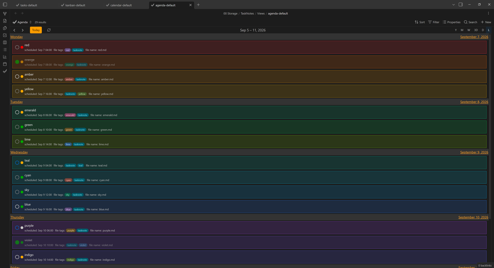
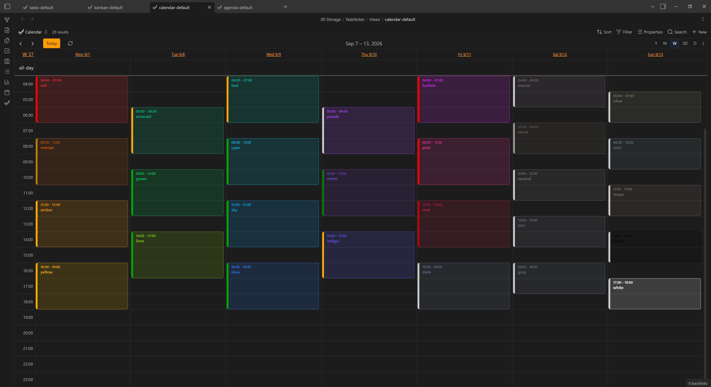
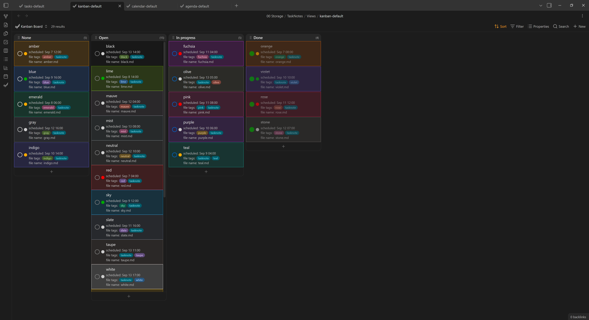
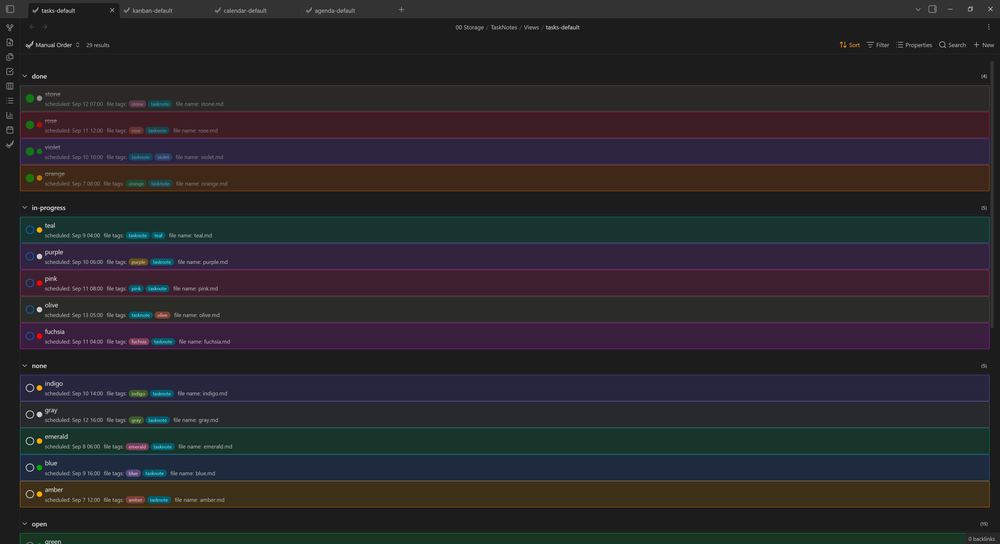
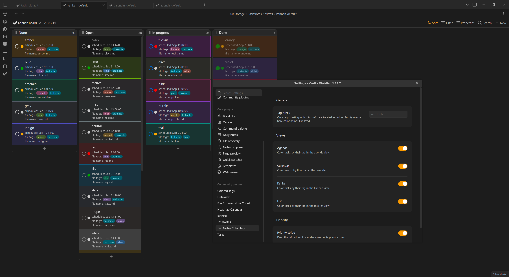
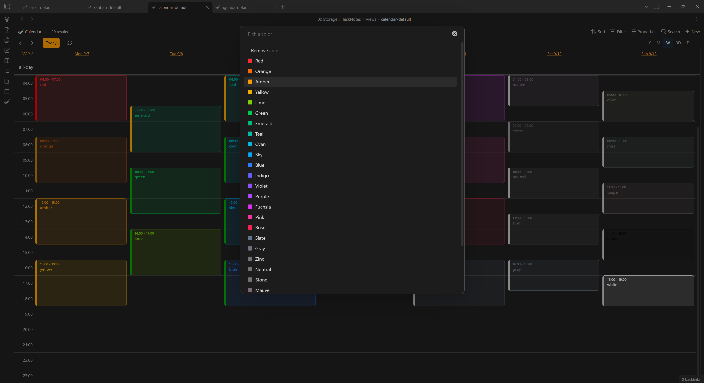

# TaskNotes Color Tags

Colors [TaskNotes](https://community.obsidian.md/plugins/tasknotes) tasks by a color-name tag, across the calendar, agenda, kanban and list views.

---

## Contents

- [Download](#download)
- [Usage](#usage)
- [Settings](#settings)
- [Screenshots](#screenshots)

---

## Download

Requires the [**TaskNotes**](https://community.obsidian.md/plugins/tasknotes) plugin and Obsidian **1.13+**.

- [TaskNotes Color Tags](https://obsidian.md/plugins?id=tasknotes-color-tags)
- [GitHub](https://github.com/neclor/tasknotes-color-tags)

---

## Usage

1. Enable the plugin. By default all four views are colored.
2. Give a task note a color tag - `#red`, `#blue`, `#zinc`, … (any [Tailwind color name](https://tailwindcss.com/docs/colors)).
   The task is tinted with that color everywhere it appears.
3. Or set it from the UI: **right‑click a task - Set color**, pick from the list, or *Remove color*.

Only recognized color names are used; other tags are ignored. If a task has several color tags, the last one wins.

---

## Settings

| Setting | Default | What it does |
| --- | --- | --- |
| **Tag prefix** | *(empty)* | Restrict color tags to this prefix (e.g. `tnct-` - only `#tnct-red` counts). |
| **Agenda / Calendar / Kanban / List** | on | Toggle coloring per view. |
| **Priority stripe** | on | Keep the calendar event's left edge in its priority color. |

---

## Screenshots

| Agenda | Calendar | Kanban | List |
| --- | --- | --- | --- |
|  |  |  |  |  |

| Settings | Color picker |
| --- | --- |
|  |  |

---
